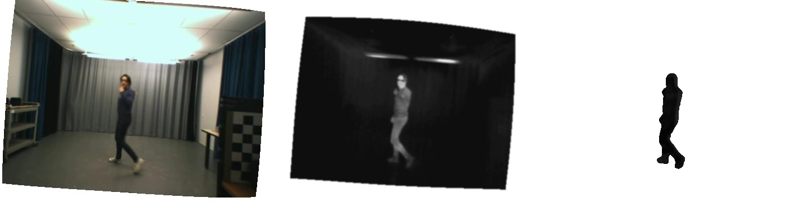
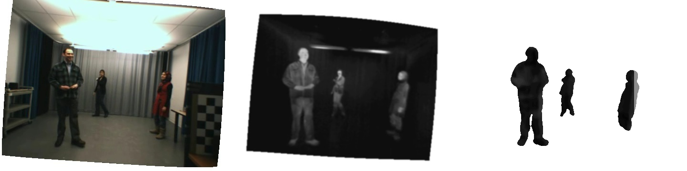
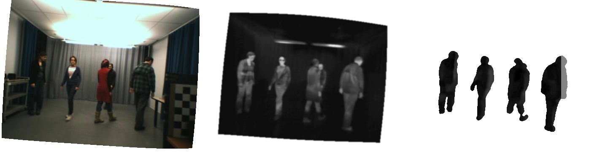

# Domain Siamese CNNs for Sparse Multispectral Disparity Estimation

This repository contains all the code to reproduce the experiments made in our paper [Domain Siamese CNNs for Sparse Multispectral Disparity Estimation](https://arxiv.org/pdf/2005.00088.pdf) accepted at ICPR 2020.

Here are some examples of the disparity maps with the human silhouettes segmented. The segmentation masks were provided with the dataset.







## Usage

### Dependencies
You can find the dependencies of the project in the [requirements.txt](requirements.txt) file. To install them all, simply type:
```
pip install -r requirements.txt
```

### Datasets
Download both datasets in a folder named "litiv" on your computer. For the LITIV 2018 dataset, both the rectified images (used for this paper) and the raw images are available.
* [LITIV 2014](https://share.polymtl.ca/alfresco/service/api/path/content;cm:content/workspace/SpacesStore/Company%20Home/Sites/litiv-web/documentLibrary/Datasets/BilodeauetAlInfraredDataset.zip?a=true&guest=true)
* [LITIV 2018](https://polymtlca0-my.sharepoint.com/personal/guillaume-alexandre_bilodeau_polymtl_ca/_layouts/15/onedrive.aspx?originalPath=aHR0cHM6Ly9wb2x5bXRsY2EwLW15LnNoYXJlcG9pbnQuY29tLzpmOi9nL3BlcnNvbmFsL2d1aWxsYXVtZS1hbGV4YW5kcmVfYmlsb2RlYXVfcG9seW10bF9jYS9Fa0xEdERmQXB6eEJzS0tET1J3ZXNSQUJzb3NJQmExOXBrelpDTEZyVm1HVVhRP3J0aW1lPWp4WjNLa1FuMkVn&id=%2Fpersonal%2Fguillaume%2Dalexandre%5Fbilodeau%5Fpolymtl%5Fca%2FDocuments%2FLITIV2018Dataset%2Fstcharles2018)

### Train
This is an example of a possible command to train our network.
```
python train.py --fold 1 --model domainnet
```
To see all possible options, simply use:
```
python train.py --help
```

### Test
Here is an example of you want to test the network:
```
python test.py --fold 1 \ 
               --model domainnet \ 
               --loadmodel pretrained/domainnet/fold1.pt \ 
               --max_disparity 64 \
               --n 3
```
Once again, to see all available options, use:
```
python test.py --help
```

## Contact
For any comments, questions or concerns, feel free to contact me at david-alexandre.beaupre@polymtl.ca

## License
See the LICENSE file for more details.
